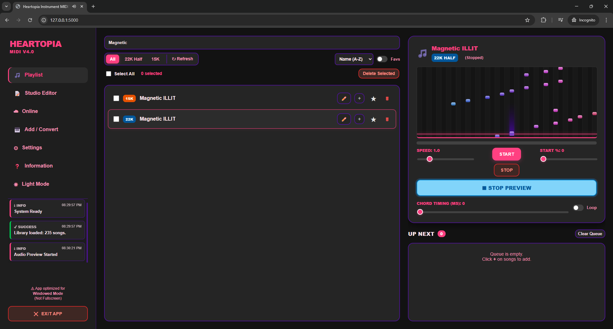
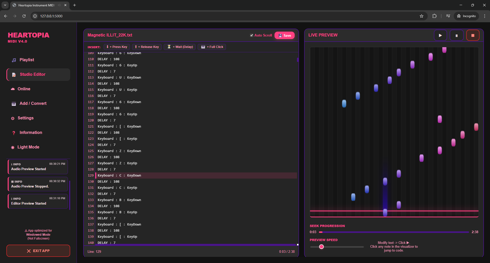

<h1 align="center">Heartopia Instrument MIDI V4</h1>

  <b>The Ultimate Automated Instrument Player for Heartopia</b> 
  🎵 Studio Editor • 🎹 Visual Piano Roll • ⚡ 60FPS Smooth UI

  <a href="#-features">Features</a> •
  <a href="#-how-to-use">How To Use</a> •

---

### 🎥 Watch the Demo

  
  
<i>(Note: Demo video used is V3)</i>

---

### 🎹 What is Heartopia V4?
**Heartopia Instrument MIDI V4** is the next evolution of the classic auto-player. It retains the modern **Web-Based Interface** but has been supercharged with a **Studio Editor**, a **Visual Piano Roll**, and a completely rewritten rendering engine using **WebSockets** for lag-free performance.

---

### ✨ New V4 Features

* **⚡ Real-Time UI (WebSocket Integration):** * We have replaced the old polling system (setInterval) with **Flask-SocketIO**. 
    * The server now pushes progress updates **60 times a second**, making the progress bar, timer, and visualizers butter-smooth with zero lag.
* **📝 Studio Editor Tab:**
    * A full-fledged script editor built right into the app.
    * **Live Sync:** The text area highlights the exact line of code playing in real-time.
    * **Click-to-Find:** Click any note in the visualizer to instantly jump to that specific line of code to edit mistakes.
    * **Quick Inserts:** Easily add delays, notes, or chords without memorizing syntax.
* **🎹 Audio & Visual Preview (Piano Roll):** * Preview songs before playing them in-game! 
    * Features a pro-grade **Synthesia-style Visualizer** with lane detection and hit lighting effects.
* **☁️ Enhanced Online Library:** * **Pagination Added:** Browse thousands of songs without the previous 50-item limit.
    * **Batch Actions:** Select multiple community songs and download them all at once.
* **🎵 Smart Queue & Playlist:** Organize your setlist, loop playback, and filter your library by name or date.
* **📂 Drag & Drop Converter:** Convert multiple `.mid` files at once with adjustable **Pitch Shift** and **Target Instrument** (22K or 15K).

---

### 🛠️ Patch Notes

#### V4.1 Studio Editor Hotfix (Latest)
* **🚀 Monaco Engine Integration:** Replaced the standard text box with the **Monaco Editor** (the engine powering VS Code).
* **⚡ Massive Performance Boost:** The editor now supports **1,000,000+ lines** of code with zero lag using virtual scrolling. Fixed issues where files larger than 100k lines would crash the UI.
* **🎯 Precision Sync Fix:** Fixed an issue where the text highlighter would drift off-sync. It now tracks playback with millisecond precision.
* **🔍 Pinpoint Click-to-Find:** Clicking a note in the visualizer now calculates the exact line number and centers it instantly.

#### V4.0 Major Update
* **NEW: Studio Editor:** Added a dedicated tab for editing `.txt` scripts. Includes sync-scrolling and visual debugging tools.
* **NEW: Visualizer Engine:** Added a high-performance Canvas-based Piano Roll to the Playlist and Editor tabs.
* **NEW: WebSocket Architecture:** Completely removed the 500ms polling lag. The app now communicates via WebSockets for instantaneous, high-framerate UI updates.
* **NEW: Online Pagination:** Fixed the issue where only the first 50 songs were visible in the Online tab. You can now browse the entire database.

#### V3.3 Legacy Hotfix
* **✅ Expanded Keybinds:** Fixed the settings menu to support **all keyboard keys**. You are no longer restricted to F1-F12.
* **✅ Playlist Multi-Select:** Added checkboxes to the playlist for batch deletion.
* **✅ Activity Console:** Added a live "Info Console" to the sidebar.

#### V3.1 - V3.2 Legacy Fixes
* **✅ Playback Speed Bug:** Fixed speed resetting to 1.0x on restart.
* **✅ Sticky Keys:** Fixed keys remaining held down when pausing.
* **✅ Alt-Tab Safety:** Auto-stop when switching windows to prevent typing in other apps.

> **🐛 Encountered a new bug?**
> If you have an issue not listed here, please **[Create an Issue](../../issues)** in this repository.

---

### 📸 App Interface

  <table>
    <tr>
      <td align="center" width="50%"><b>🎵 Visual Piano Roll (V4)</b></td>
      <td align="center" width="50%"><b>📝 Studio Editor (V4)</b></td>
    </tr>
    <tr>
      <td></td>
      <td></td>
    </tr>
    <tr>
      <td align="center"><b>☁️ Online Cloud Library</b></td>
      <td align="center"><b>📂 Batch Converter</b></td>
    </tr>
    <tr>
      <td></td>
      <td></td>
    </tr>
  </table>

---

### ⚠️ Important: Antivirus False Positives

**Is this a virus? No.**

If you download the `.exe`, your antivirus (Windows Defender, Avast, etc.) may flag it as a **Trojan** or **Malware**.

**Why does this happen?**
1.  **Automation Behavior:** This app uses libraries (`pydirectinput`) designed to take control of your keyboard. Antivirus software often mistakes this for malicious behavior.
2.  **Unsigned Code:** As an independent developer, I do not have a digital code-signing certificate.

* **Safe Workaround - Exclusion Folder:**
    1.  Create a folder named `HeartopiaPlayer`.
    2.  Open **Windows Security** > **Virus & threat protection** > **Manage settings** > **Exclusions**.
    3.  Add the `HeartopiaPlayer` folder to exclusions.
    4.  Extract the app there. It will run without issues.

---

### 📖 How to Use

1.  **Launch:** Run the application. A browser window will open automatically.
2.  **Get Songs**:
    * **☁️ Online Tab:** Search for songs, use the new **Next/Prev** buttons to browse pages, and download.
    * **🎹 Add / Convert Tab:** Drag and drop `.mid` files and click **Convert**.
3.  **Edit (Optional):**
    * Go to **Studio Editor**, select a song, and use the Visualizer to find and fix mistakes.
4.  **Play**:
    * Go to **Playlist**, add songs to **Queue**.
    * Press **Start (Default: F4)** to begin playing.
    * Press **Stop (Default: F5)** to halt.

---

  Made with ❤️ by KaleidSkylark

