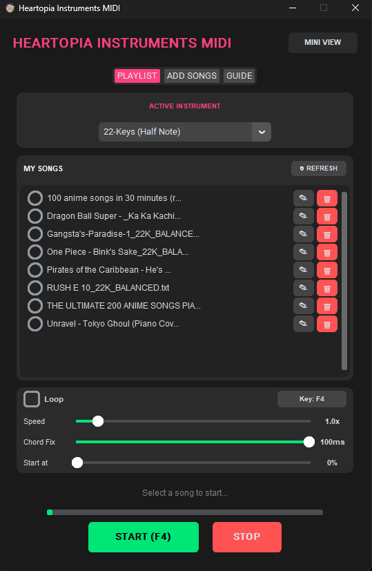
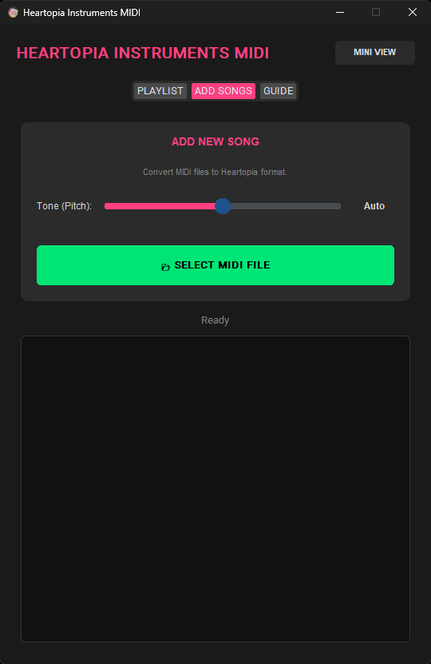
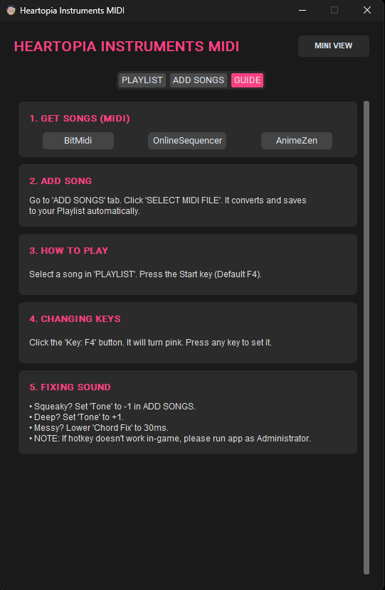

  

<h1 align="center">Heartopia Instruments MIDI</h1>

  <b>The Ultimate Auto-Player for Heartopia</b> 
  No Python Required • No Configuration • Beginner Friendly

  <a href="#-features">Features</a> •
  <a href="#-how-to-use">How To Use</a> •
  <a href="#-download">Download</a>

---

### 🎹 Why this is the best?
**Heartopia Instruments MIDI** is a standalone tool designed to play perfect music in-game automatically. Unlike other scripts, you don't need to install Python, code anything, or mess with complex settings. Just download and play.

It features a **Smart Converter** that fixes "whack" MIDI files automatically, ensuring your songs never sound squeaky or messy.

---

### ✨ Features

* **🚀 Zero Setup:** Just run the `.exe` file. No coding knowledge required.
* **🧠 Smart AI Conversion:** Automatically fixes songs that are too high (squeaky) or too low (deep).
* **🎹 Dual Instrument Support:** Works for both **22-Key** and **15-Key** instruments.
* **⚡ 100% Admin Control:** Custom Hotkeys (F4, Z, Insert, etc.) work flawlessly inside the game.
* **🎨 Beautiful UI:** Clean, dark-themed interface that matches the game aesthetic.
* **🛠️ Pro Tools:** Adjust Speed (0.1x - 10x), Skip Intros, and Loop songs.

---

### 📸 App Interface

  <table>
    <tr>
      <td align="center"><b>Main Playlist</b></td>
      <td align="center"><b>Smart Converter</b></td>
      <td align="center"><b>Built-in Guide</b></td>
    </tr>
    <tr>
      <td></td>
      <td></td>
      <td></td>
    </tr>
  </table>

---

### 📖 How to Use

1.  **Download & Run**: Download `Heartopia Instruments MIDI.exe` and run it (Right-click > Run as Admin for best results).
2.  **Get Songs**: Download any `.mid` file from sites like *BitMidi* or *OnlineSequencer*.
3.  **Add Song**: Go to the **ADD SONGS** tab in the app and select your MIDI file. It will auto-convert.
4.  **Play**: Go to the **PLAYLIST** tab, select your song, and press your **Start Key** (Default F4).

> **Tip:** If a song sounds messy, lower the "Chord Fix" slider to 30ms!

---

### 📥 Download
[**Click Here to Download Latest Version**](#)

---

  Made with ❤️ for the Heartopia Community

