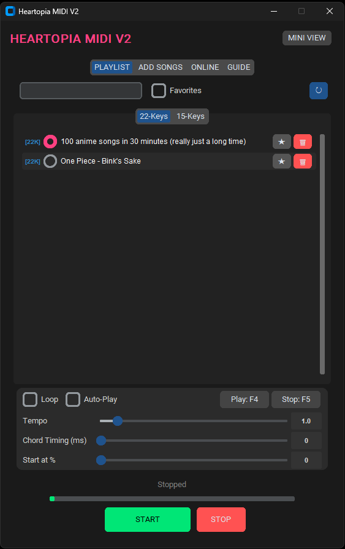

<h1 align="center">Heartopia Instruments MIDI V2</h1>
<h2 align="center">🚧NEW VERSION IS UNDER DEVELOPMENT, WILL BE MORE ACCESSIBLE🚧</h2>

  <b>The Ultimate Auto-Player for Heartopia</b> 
  ☁️ Cloud Library • ⚡ Instant Startup No Complicated Setup• 

  <a href="#-features">Features</a> •
  <a href="#-how-to-use">How To Use</a> •
  <a href="#-download">Download</a>

---

### 🎥 Watch the Demo

  
  
<i>Click the image above to watch the tutorial</i>

---

### 🎹 Why V2 is the best?
**Heartopia MIDI V2** has been completely rebuilt. Includes a **Community Cloud Library**. You can download for MIDI files manually—browse and download songs uploaded by the community directly inside the app!
---

### ✨ New V2 Features

* **☁️ Online Community Cloud:** Search, download, and upload songs directly from the app. No web browser needed!
* **📺 Mini View Mode:** Shrink the app to a tiny overlay widget to save screen space.
* **🧠 Smart Converter V2:** Enhanced pitch correction with "Auto-Tune" sliders for squeaky MIDIs.
* **⚡ 100% Hotkey Control:** Play/Stop/Pause using F4/F5 even while the app is in the background.
* **🎹 Dual Instrument Support:** Works for both **22-Key Half-Note Enabled** and **15-Key** instruments.

---

### 📸 App Interface

  <table>
    <tr>
      <td align="center" width="50%"><b>Main Playlist (V2 Dark Theme)</b></td>
      <td align="center" width="50%"><b>☁️ Online Cloud Library</b></td>
    </tr>
    <tr>
      <td></td>
      <td></td>
    </tr>
    <tr>
      <td align="center"><b>Smart MIDI Converter</b></td>
      <td align="center"><b>Built-in Guide</b></td>
    </tr>
    <tr>
      <td></td>
      <td></td>
    </tr>
  </table>

---

### 📖 How to Use

1.  **Download & Run**: Download `Heartopia MIDI V2.exe` and run it.
2.  **Get Songs (Two Ways)**:
    * **☁️ Community Online Tab:** Click the "Online" tab, search for a community song, and click ⬇ to download it instantly.
    * **📂 Converter:** Download any `.mid` file from the web, go to **ADD SONGS**, and select it.
3.  **Play**: Go to the **PLAYLIST**, select your song, and press **F4** to start playing.

---

  Made with ❤️ for the Heartopia Community

