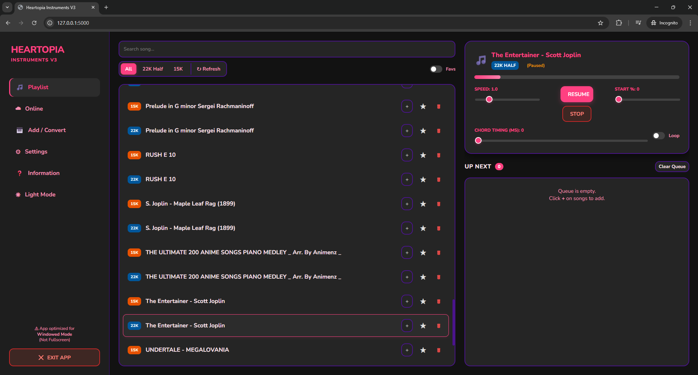
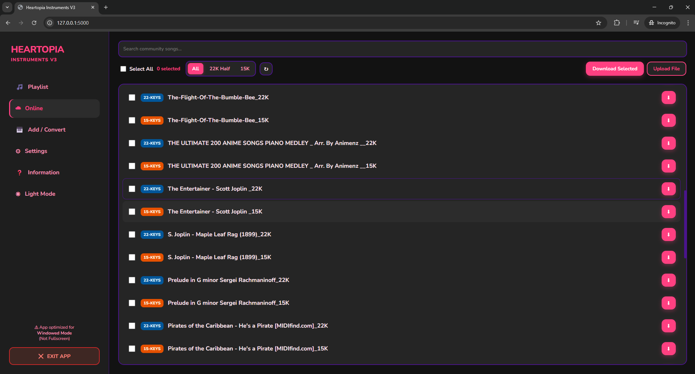
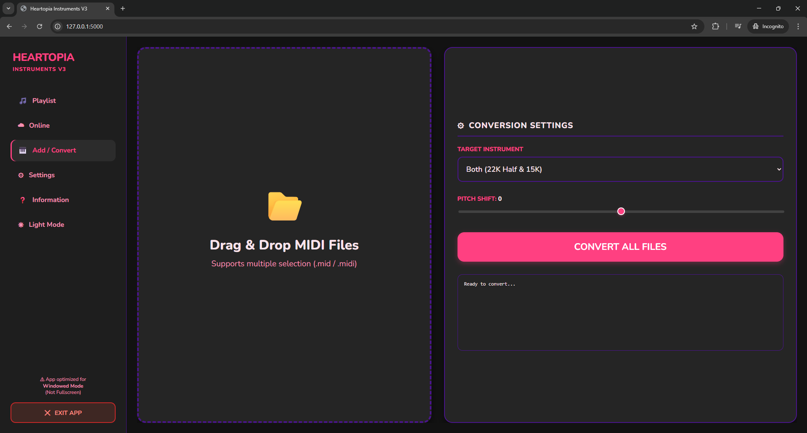
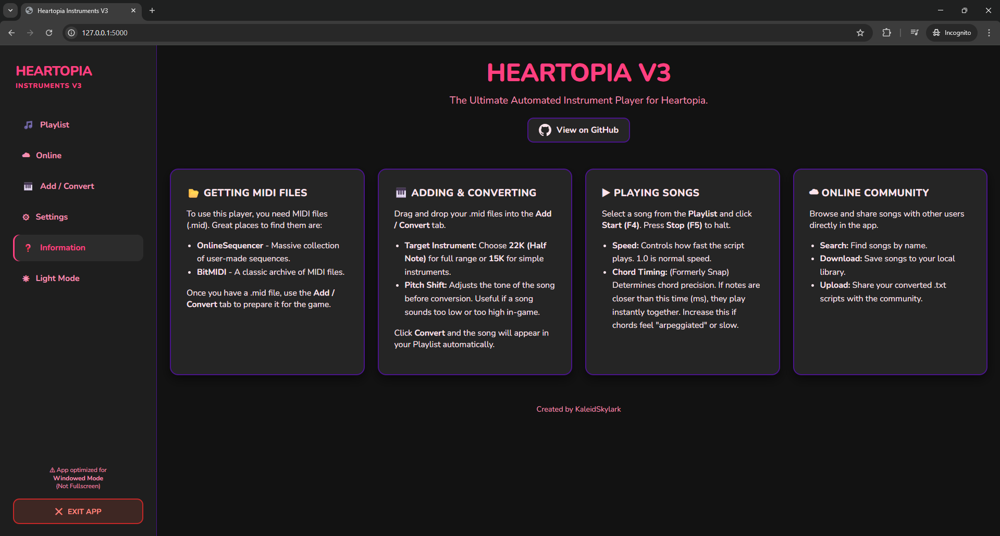

<h1 align="center">Heartopia Instrument MIDI V3</h1>

  <b>The Ultimate Automated Instrument Player for Heartopia</b> 
  🎵 Smart Queue • ☁️ Community Cloud • 🎨 Modern Web UI

  <a href="#-features">Features</a> •
  <a href="#-how-to-use">How To Use</a> 

---

### 🎥 Watch the Demo

  
  
<i>(Note: Demo video to be updated for V3)</i>

---

### 🎹 What is Heartopia V3?
**Heartopia Instruments V3** is a complete rewrite of the classic auto-player. It now features a beautiful, modern **Web-Based Interface** that runs locally on your PC. It introduces long-awaited features like a **Song Queue**, **Looping**, **Start % Seeking**, and fully customizable **Hotkeys**.

---

### ✨ New V3 Features

* **🎨 Modern Web UI:** A responsive, smooth interface with built-in **Light & Dark Themes**.
* **🎵 Smart Queue System:** Queue up multiple songs to play back-to-back automatically without stopping.
* **☁️ Online Community V3:** Select multiple songs and **Batch Download** them instantly. Upload your own conversions directly through the browser.
* **🎛️ Advanced Playback Controls:**
    * **Start at:** Start the song from 0% to 100% (skip intros!).
    * **Loop:** Repeat the current song automatically.
    * **Chord Timing:** (Formerly Snap) Adjust chord precision in milliseconds.
* **📂 Drag & Drop Converter:** Convert multiple `.mid` files at once with adjustable **Pitch Shift** and **Target Instrument** (22K or 15K).
* **⚙️ Custom Settings:** Change your song folder path and bind **Play/Stop** to any key you want (Default: F4/F5).

---

### 🛠️ V3.1 Hotfix

* **✅ Sticky Keys / Character Movement:** Fixed an issue where pausing the player and exiting the piano would cause keys to remain "held down," making the character move unintentionally.
* **✅ Queue Playback Logic:** Fixed a bug where selecting a new song after a pause and pressing Start (F4) would incorrectly resume the *previous* song.
* **✅ Alt-Tab Safety:** The player now detects when you switch windows (Alt-Tab) or change programs and automatically stops pressing keys to prevent typing elsewhere.
* **✅ F5 Page Refresh:** Prevented the default browser "Refresh" action when pressing F5. It now correctly functions only as the "Stop" hotkey without reloading the UI.

> **🐛 Encountered a new bug?**
> If you have an issue not listed here, please **[Create an Issue](../../issues)** in this repository.

---

### 📸 App Interface

  <table>
    <tr>
      <td align="center" width="50%"><b>🎵 Playlist & Queue (Dark Mode)</b></td>
      <td align="center" width="50%"><b>☁️ Online Cloud Library</b></td>
    </tr>
    <tr>
      <td></td>
      <td></td>
    </tr>
    <tr>
      <td align="center"><b>📂 Batch Converter</b></td>
      <td align="center"><b>❓ Built-in Guide</b></td>
    </tr>
    <tr>
      <td></td>
      <td></td>
    </tr>
  </table>

---

### ⚠️ Important: Antivirus False Positives

**Is this a virus? No.**

If you download the `.exe`, your antivirus (Windows Defender, Avast, etc.) may flag it as a **Trojan** or **Malware**.

**Why does this happen?**
1.  **Automation Behavior:** This app uses libraries (`pydirectinput`, `keyboard`) specifically designed to take control of your keyboard to play the instrument. Antivirus software cannot distinguish between a game macro and a malicious program trying to hijack your input.
2.  **Unsigned Code:** I am an independent developer and do not have a costly digital code-signing certificate. Windows defaults to blocking unsigned apps that interact with system inputs.

* **Option 2 (Safe Workaround - Exclusion Folder):**
    Instead of turning off your antivirus, you can create a specific folder that your antivirus ignores.
    1.  Create a new folder on your Desktop/Downloads anywhere (e.g., named `HeartopiaPlayer` or whatever you want).
    2.  Open **Windows Security** > **Virus & threat protection**.
    3.  Click **Manage settings**.
    4.  Scroll down to **Exclusions** and click **Add or remove exclusions**.
    5.  Click **Add an exclusion** > **Folder** and select the folder you created in Step 1.
    6.  Download and extract the Heartopia `.exe` into this folder. It will now run without issues while keeping the rest of your PC protected.

---

### 📖 How to Use

1.  **Launch:** Run the application. A browser window will open with the interface.
2.  **Get Songs**:
    * **☁️ Online Tab:** Search for songs, check the boxes, and click **Download Selected**.
    * **🎹 Add / Convert Tab:** Drag and drop `.mid` files, select your instrument (22K/15K), and click **Convert All Files**.
3.  **Play**:
    * Go to **Playlist**, click `+` to add songs to your **Queue**.
    * Press **Start (Default: F4)** to begin playing.
    * Press **Stop (Default: F5)** to halt.
4.  **Settings**: Go to the **Settings** tab to change your storage folder or rebind your hotkeys.

---

  Made with ❤️ by KaleidSkylark

