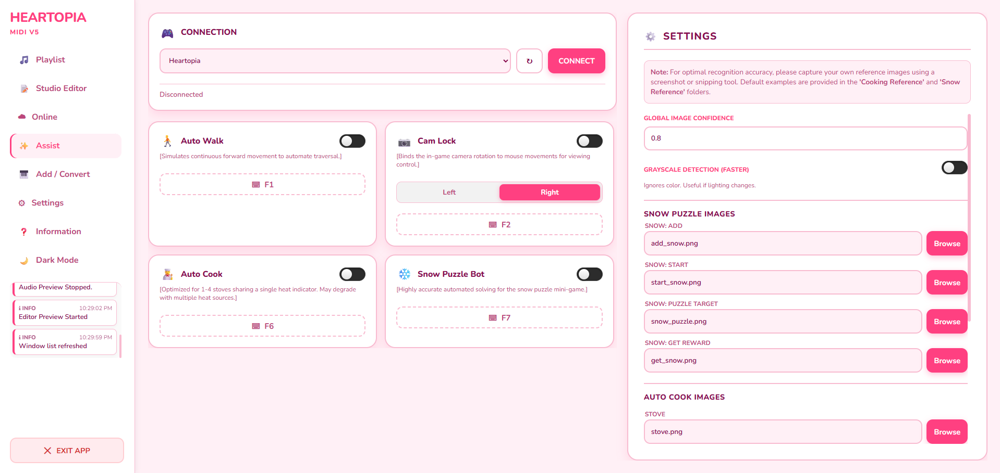
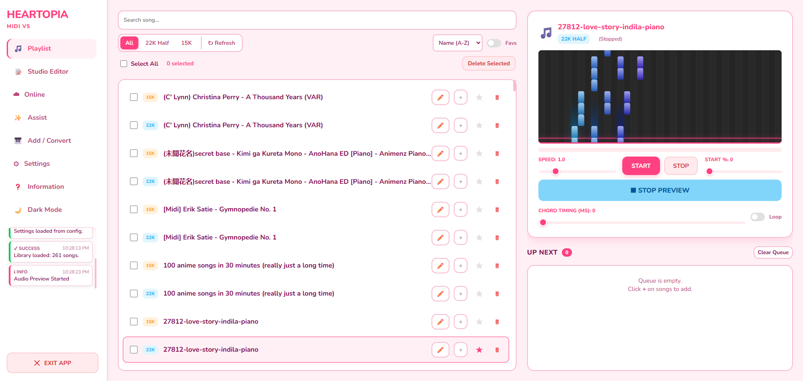
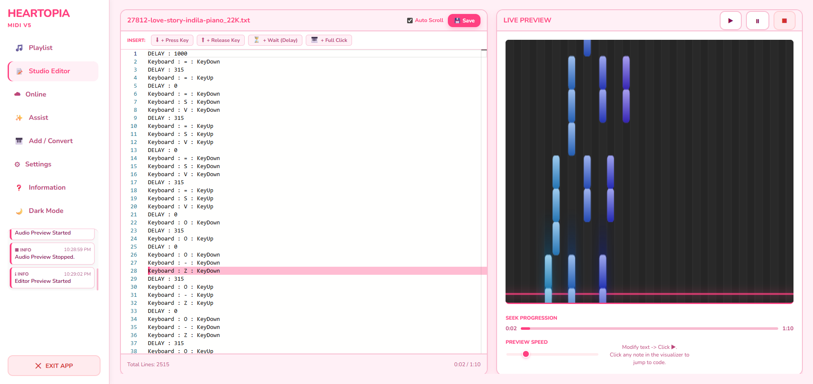
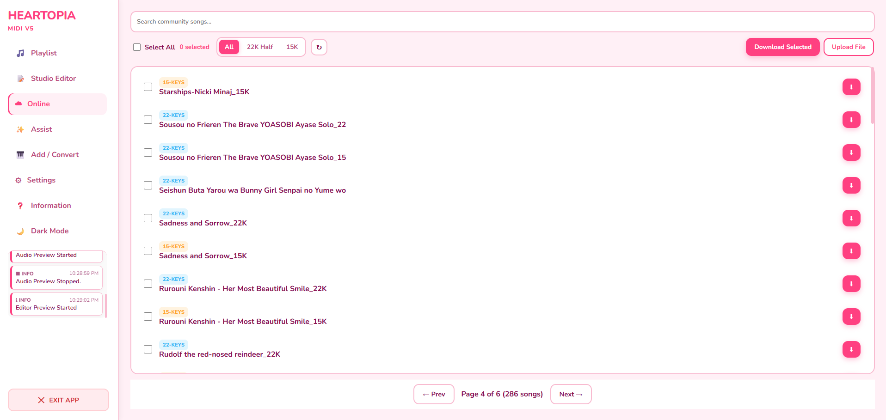
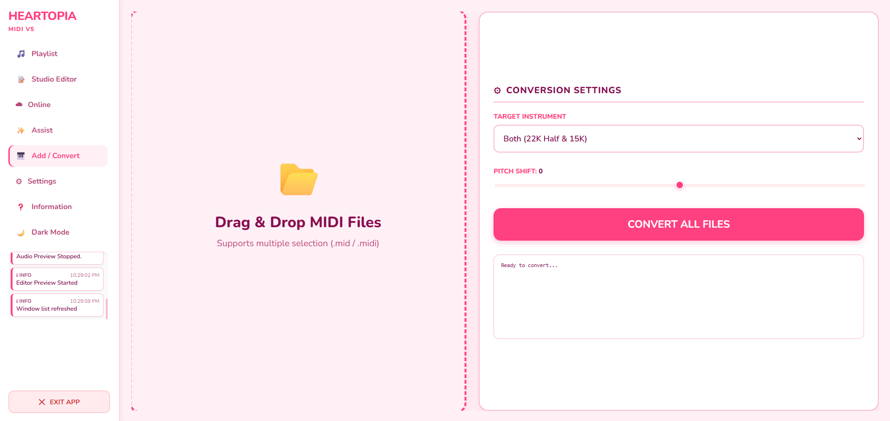
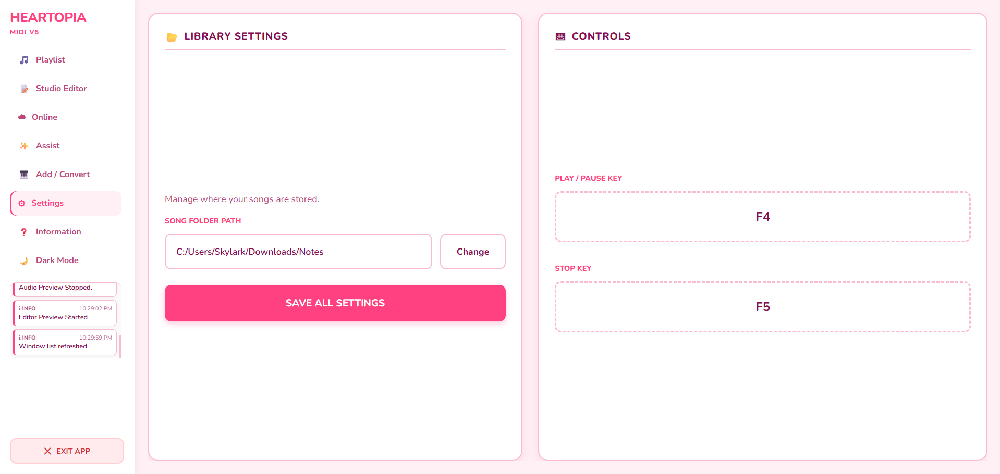
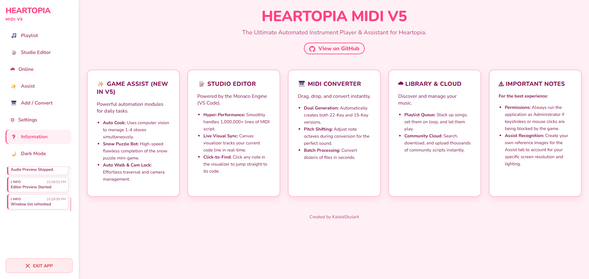

  <h3>✨ Visit my personal Wiki ✨</h3>
  

 

<h1 align="center">Heartopia Instrument MIDI V5</h1>

  <b>The Ultimate Automated Instrument Player & Assistant for Heartopia</b> 
  🎵 Studio Editor • 🎹 Visual Piano Roll • 🎮 Game Assist •

  <a href="#-features">Features</a> •
  <a href="#-how-to-use">How To Use</a> •

---

### 🎥 Watch the Demo

  
  
<i>(Note: Demo video used is V5)</i>

---

### 🎹 What is Heartopia V5?
**Heartopia Instrument MIDI V5** is the next evolution of the classic auto-player. It retains the powerful **Studio Editor** and **Visual Piano Roll** from V4 but introduces the all-new **Game Assist** module—a suite of automation tools designed to help with daily tasks like cooking and puzzles using computer vision.

---

### ✨ New V5 Features

* **🎮 Game Assist Module (NEW):**
    * **Auto Cook:** Uses computer vision to manage 1-4 stoves simultaneously.
    * **Snow Puzzle Bot:** High-speed flawless completion of the snow puzzle mini-game.
    * **Auto Walk & Cam Lock:** Effortless traversal and camera management.
---

### 🛠️ Patch Notes History

#### V5.0 Major Update (Latest)
* **NEW: Game Assist Tab:** Added a dedicated tab for game automation tools.
* **NEW: Auto Cooker:** Added image recognition for automatic cooking on multiple stoves.
* **NEW: Snow Puzzle Solver:** Added an automated solver for the snow mini-game.
* **Optimization:** Unified the codebase for better stability and performance.

#### V4.1 Studio Editor Hotfix
* **🚀 Monaco Engine Integration:** Replaced the standard text box with the **Monaco Editor** (the engine powering VS Code).
* **⚡ Massive Performance Boost:** The editor now supports **1,000,000+ lines** of code with zero lag using virtual scrolling. Fixed issues where files larger than 100k lines would crash the UI.
* **🎯 Precision Sync Fix:** Fixed an issue where the text highlighter would drift off-sync. It now tracks playback with millisecond precision.
* **🔍 Pinpoint Click-to-Find:** Clicking a note in the visualizer now calculates the exact line number and centers it instantly.

#### V4.0 Major Update
* **NEW: Studio Editor:** Added a dedicated tab for editing `.txt` scripts. Includes sync-scrolling and visual debugging tools.
* **NEW: Visualizer Engine:** Added a high-performance Canvas-based Piano Roll to the Playlist and Editor tabs.
* **NEW: WebSocket Architecture:** Completely removed the 500ms polling lag. The app now communicates via WebSockets for instantaneous, high-framerate UI updates.
* **NEW: Online Pagination:** Fixed the issue where only the first 50 songs were visible in the Online tab. You can now browse the entire database.

#### V3.3 Legacy Hotfix
* **✅ Expanded Keybinds:** Fixed the settings menu to support **all keyboard keys**. You are no longer restricted to F1-F12.
* **✅ Playlist Multi-Select:** Added checkboxes to the playlist for batch deletion.
* **✅ Activity Console:** Added a live "Info Console" to the sidebar.

#### V3.1 - V3.2 Legacy Fixes
* **✅ Playback Speed Bug:** Fixed speed resetting to 1.0x on restart.
* **✅ Sticky Keys:** Fixed keys remaining held down when pausing.
* **✅ Alt-Tab Safety:** Auto-stop when switching windows to prevent typing in other apps.

> **🐛 Encountered a new bug?**
> If you have an issue not listed here, please **[Create an Issue](../../issues)** in this repository.

---

### 📸 App Interface

  <h3>🎮 Game Assist (New)</h3>
  

  <h3>🎵 Playlist & Visuals</h3>
  

  <h3>📝 Studio Editor</h3>
  

  <h3>☁️ Online Cloud Library</h3>
  

  <h3>🎹 Converter</h3>
  

  <h3>⚙️ Settings</h3>
  

  <h3>❓ Information</h3>
  

---

### ⚠️ Important: Antivirus False Positives

**Is this a virus? No.**

If you download the `.exe`, your antivirus (Windows Defender, Avast, etc.) may flag it as a **Trojan** or **Malware**.

**Why does this happen?**
1.  **Automation Behavior:** This app uses libraries (`pydirectinput`, `pyautogui`) designed to take control of your keyboard and mouse. Antivirus software often mistakes this for malicious behavior.
2.  **Unsigned Code:** As an independent developer, I do not have a digital code-signing certificate.

* **Safe Workaround - Exclusion Folder:**
    1.  Create a folder named `HeartopiaPlayer`.
    2.  Open **Windows Security** > **Virus & threat protection** > **Manage settings** > **Exclusions**.
    3.  Add the `HeartopiaPlayer` folder to exclusions.
    4.  Extract the app there. It will run without issues.

---

### 📖 How to Use

1.  **Launch:** Run the application. A browser window will open automatically.
2.  **Get Songs**:
    * **☁️ Online Tab:** Search for songs, use the new **Next/Prev** buttons to browse pages, and download.
    * **🎹 Add / Convert Tab:** Drag and drop `.mid` files and click **Convert**.
3.  **Assist (V5)**:
    * Go to the **Assist** tab, connect to the game window, and toggle features like **Auto Cook** or **Auto Walk**.
4.  **Play**:
    * Go to **Playlist**, add songs to **Queue**.
    * Press **Start (Default: F4)** to begin playing.
    * Press **Stop (Default: F5)** to halt.

---

  Made with ❤️ by KaleidSkylark

