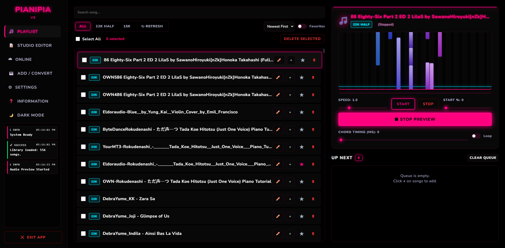
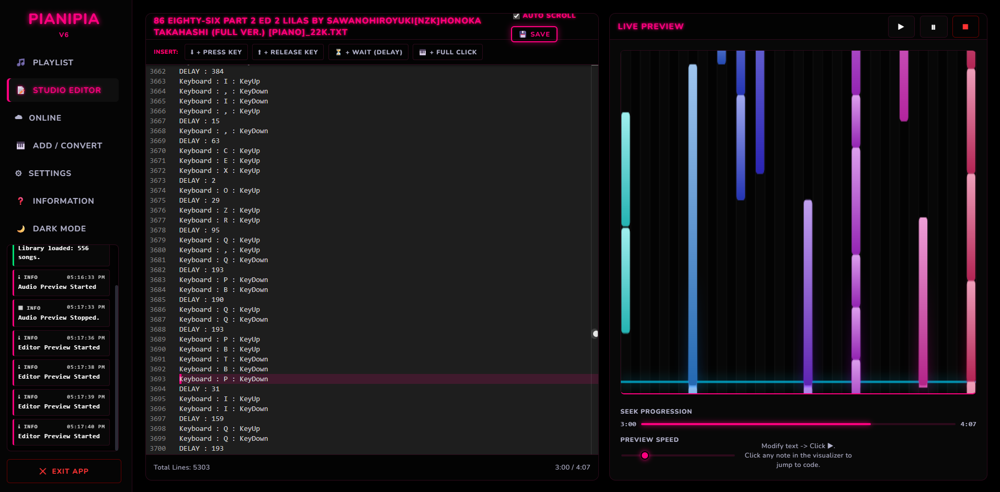
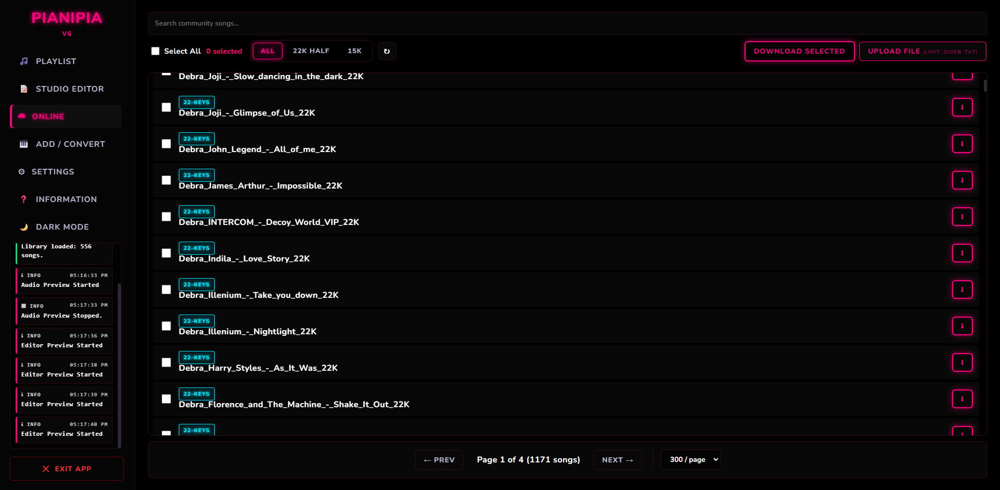
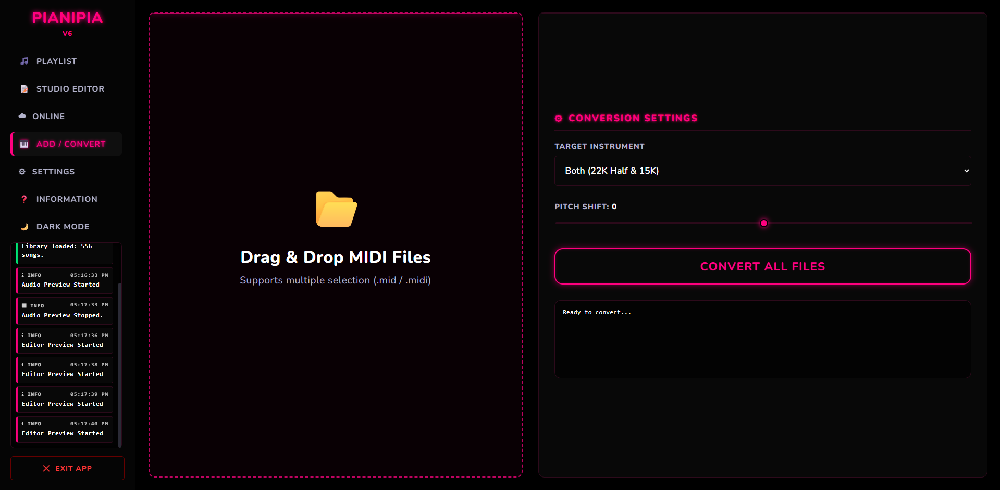
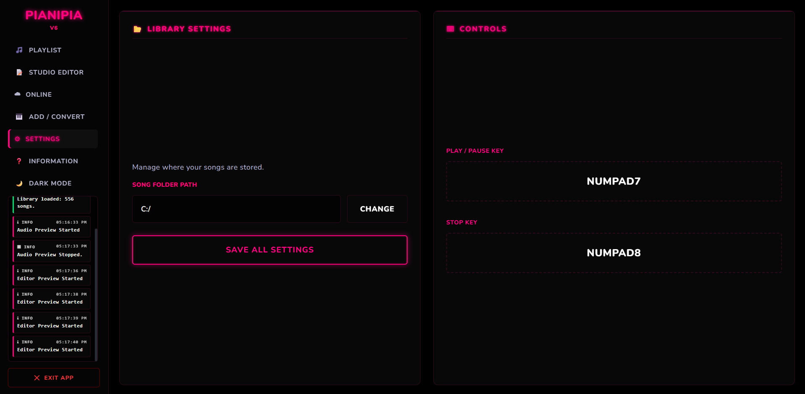
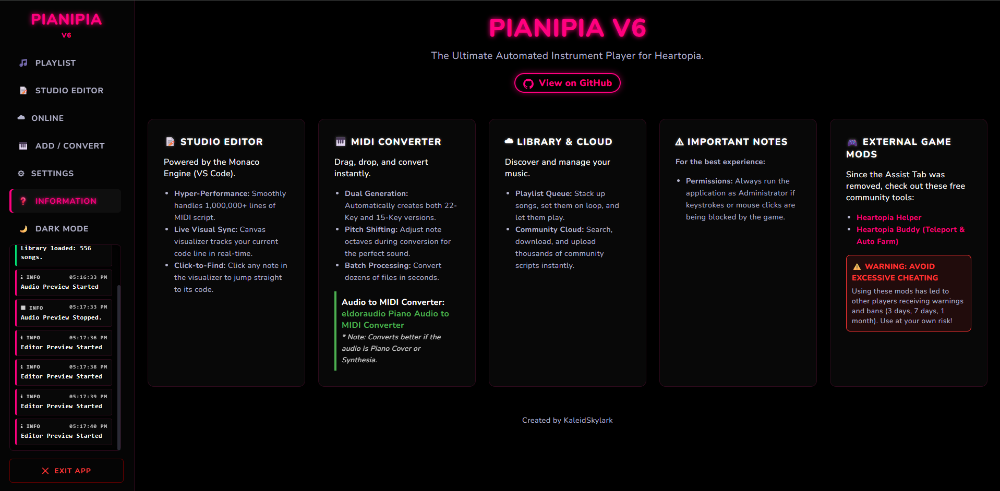

  <h3>✨ Visit my personal Wiki ✨ [CURRENLTY UPDATING]</h3>
  

 

<h1 align="center">PianiPia V6</h1>

  <b>The Ultimate Automated Instrument Player & Assistant for Heartopia</b> 
  🐍 Python Based • 🤖 Made with AI • 🎵 Studio Editor • 🎹 Visual Piano Roll

  <a href="#-features">Features</a> •
  <a href="#-how-to-use">How To Use</a>

### 🎥 Watch the Demo

  
  
<i>(Note: Demo video used is an older version)</i>

---

### 🎹 What is PianiPia V6?
**PianiPia V6** is a sophisticated **Python-based** application developed with the assistance of **Generative AI**. It represents the ultimate, streamlined evolution of the auto-player. It retains the powerful **Studio Editor** and **Visual Piano Roll** from previous versions but now features a gorgeous new **Amoled Neon UI**, lightning-fast performance, and a completely debloated core after removing the Game Assist features.

---

### ✨ Core Features
**⚠️Heartopia needs to be Foreground/Active in order to work⚠️**
* **🎵 Auto-Player:** Plays complex MIDI scripts perfectly using custom keyboard emulation.
* **📝 Studio Editor:** Monaco-powered code editor to edit and sync 1,000,000+ line MIDI scripts.
* **🎹 Visual Piano Roll:** Live visualizer tracking your code lines in real-time.
* **☁️ Community Cloud:** Search, download, and upload scripts directly from the app.

---

### 🛠️ Patch Notes History

#### V6.0 Optimization & UI Overhaul (Latest)
* **✅ Storage & Performance Optimization:** Completely removed the Game Assist tab and its heavy OpenCV dependencies. The app size has been reduced from 86MB down to just 24MB!
* **✅ Amoled Neon UI:** The entire interface has been redesigned with a gorgeous Amoled Neon aesthetic.
* **✅ Console Log Stretch:** Improved UI layout allows the console log to stretch and fit beautifully on your screen.
* **✅ Playlist Filters:** Changed the default playlist filters to make organizing your songs easier.
* **✅ Expanded Information Tab:** Added new resources and links for External Game Mods.
* **✅ Audio to MIDI Converter:** Added a recommendation and link for the *eldoraudio Piano Audio to MIDI Converter* in the Info Tab (Note: this tool converts much better if the audio is a Piano Cover or Synthesia).

#### V5.2 Converter Intelligence Update 
* **✅ 15K Smart Pitch Folding:** Implemented intelligent note folding logic specifically for 15-key songs. Notes that fall outside the playable range now automatically wrap into the valid scale instead of being deleted.
* **✅ Zero Dropped Notes:** Every single note from the source MIDI is now preserved and played. This ensures 15K songs match the rhythmic density and "fullness" of the 22K versions.
* **✅ 15K Sync Fix:** Switched 15K conversion to a "Tap Mode" logic. This eliminates "ghost notes" and de-sync issues caused by conflicting sustain durations in the previous engine.
* **✅ Smart Quantization:** "Black key" (accidental) notes now snap intelligently to their nearest valid physical key rather than being discarded.

#### V5.1 Hotfix & Improvements
* **✅ FileName Support:** Removed strict naming restrictions on uploads that is causing for Upload Issues.
* **✅ Increased Upload Limit:** Boosted the online upload limit from 200KB to **500KB** to support larger, more complex song scripts.
* **✅ Smart Pagination:** Added a custom "Per Page" selector (50/100/200/300) to the Online tab. Your preference is saved automatically to `config.json`.
* **✅ Batch Delete Fixed:** Fixed a critical bug where checking multiple songs in the Playlist and clicking "Delete Selected" would fail due to filename formatting issues.
* **✅ Download Stability:** Implemented `clean_filename` sanitization. Downloads with illegal OS characters or missing extensions are now automatically fixed, preventing "Add to Playlist" failures.

#### V5.0 Major Update
* **NEW: Game Assist Tab:** Added a dedicated tab for game automation tools.
* **NEW: Auto Cooker:** Added image recognition for automatic cooking on multiple stoves.
* **NEW: Snow Puzzle Solver:** Added an automated solver for the snow mini-game.
* **Optimization:** Unified the codebase for better stability and performance.

#### V4.1 Studio Editor Hotfix
* **🚀 Monaco Engine Integration:** Replaced the standard text box with the **Monaco Editor** (the engine powering VS Code).
* **⚡ Massive Performance Boost:** The editor now supports **1,000,000+ lines** of code with zero lag using virtual scrolling. Fixed issues where files larger than 100k lines would crash the UI.
* **🎯 Precision Sync Fix:** Fixed an issue where the text highlighter would drift off-sync. It now tracks playback with millisecond precision.
* **🔍 Pinpoint Click-to-Find:** Clicking a note in the visualizer now calculates the exact line number and centers it instantly.

#### V4.0 Major Update
* **NEW: Studio Editor:** Added a dedicated tab for editing `.txt` scripts. Includes sync-scrolling and visual debugging tools.
* **NEW: Visualizer Engine:** Added a high-performance Canvas-based Piano Roll to the Playlist and Editor tabs.
* **NEW: WebSocket Architecture:** Completely removed the 500ms polling lag. The app now communicates via WebSockets for instantaneous, high-framerate UI updates.
* **NEW: Online Pagination:** Fixed the issue where only the first 50 songs were visible in the Online tab. You can now browse the entire database.

#### V3.3 Legacy Hotfix
* **✅ Expanded Keybinds:** Fixed the settings menu to support **all keyboard keys**. You are no longer restricted to F1-F12.
* **✅ Playlist Multi-Select:** Added checkboxes to the playlist for batch deletion.
* **✅ Activity Console:** Added a live "Info Console" to the sidebar.

#### V3.1 - V3.2 Legacy Fixes
* **✅ Playback Speed Bug:** Fixed speed resetting to 1.0x on restart.
* **✅ Sticky Keys:** Fixed keys remaining held down when pausing.
* **✅ Alt-Tab Safety:** Auto-stop when switching windows to prevent typing in other apps.

> **🐛 Encountered a new bug?**
> If you have an issue not listed here, please **[Create an Issue](../../issues)** in this repository.

---

### 📸 App Interface

  <h3>🎵 Playlist & Visuals</h3>
  

  <h3>📝 Studio Editor</h3>
  

  <h3>☁️ Online Cloud Library</h3>
  

  <h3>🎹 Converter</h3>
  

  <h3>⚙️ Settings</h3>
  

  <h3>❓ Information</h3>
  

---

### ⚠️ Important: Antivirus False Positives

**Is this a virus? No.**

If you download the `.exe`, your antivirus (Windows Defender, Avast, etc.) may flag it as a **Trojan** or **Malware**.

**Why does this happen?**
1.  **Automation Behavior:** This app uses libraries (`pydirectinput`, `pyautogui`) designed to take control of your keyboard and mouse. Antivirus software often mistakes this for malicious behavior.
2.  **Unsigned Code:** As an independent developer, I do not have a digital code-signing certificate.

* **Safe Workaround - Exclusion Folder:**
    1.  Create a folder named `PianiPiaPlayer`.
    2.  Open **Windows Security** > **Virus & threat protection** > **Manage settings** > **Exclusions**.
    3.  Add the `PianiPiaPlayer` folder to exclusions.
    4.  Extract the app there. It will run without issues.

---

### 📖 How to Use

1.  **Launch:** Run the application. A browser window will open automatically.
2.  **Get Songs**:
    * **☁️ Online Tab:** Search for songs, use the **Next/Prev** buttons to browse pages, and download.
    * **🎹 Add / Convert Tab:** Drag and drop `.mid` files and click **Convert**.
3.  **Play**:
    * Go to **Playlist**, add songs to **Queue**.
    * Press **Start (Default: F4)** to begin playing.
    * Press **Stop (Default: F5)** to halt.

---

  Made with ❤️ by KaleidSkylark

